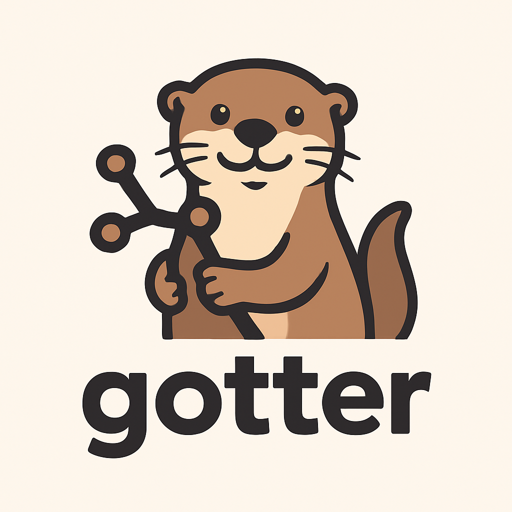

# Gotter

Gotter keeps your GitOps repository up-to-date by automatically syncing Helm chart versions from different registries.

Configuration:

| Variable | Description | Default |
|----------|-------------|---------|
| `GOTTER_HOST` | Server host address | `0.0.0.0` |
| `GOTTER_PORT` | Server port | `8080` |

Supported Registries & Manifests

| Registry     | Supported Manifests | Integration Type | Notes |
|--------------|---------------------|------------------|-------|
| ArtifactHub  | Kustomize           | Webhook + API    | Detects Helm chart publishes and updates Kustomize manifests (patches kustomization YAML or patch files) |

Roadmap

- Add support for additional registries (ChartMuseum, Harbor, OCI registries) and manifest formats (Helm values, plain YAML) in future releases.

See the full README in the repository for detailed usage and contributing guidelines.